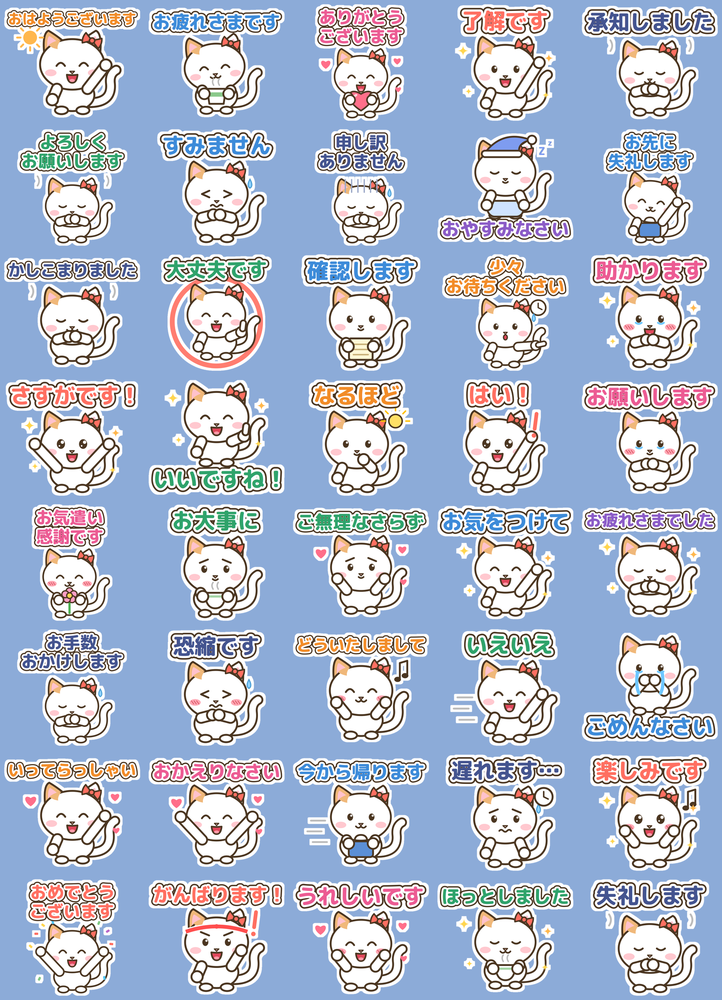
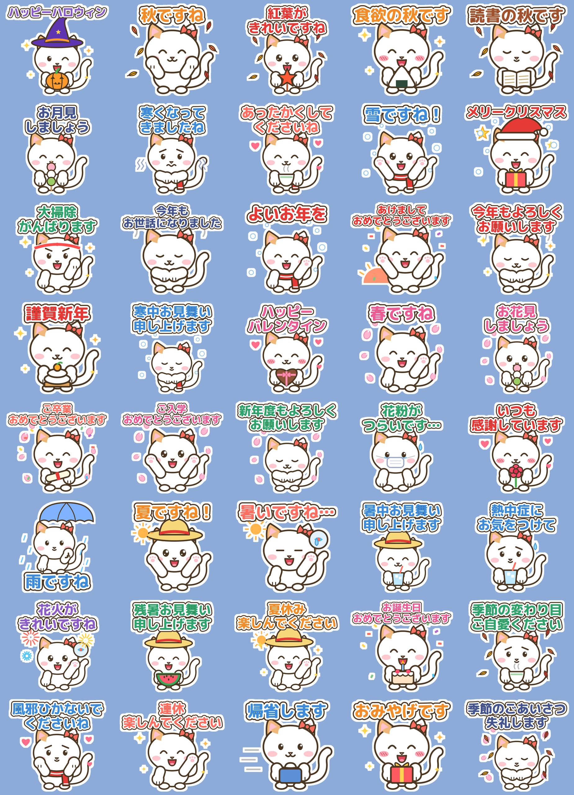
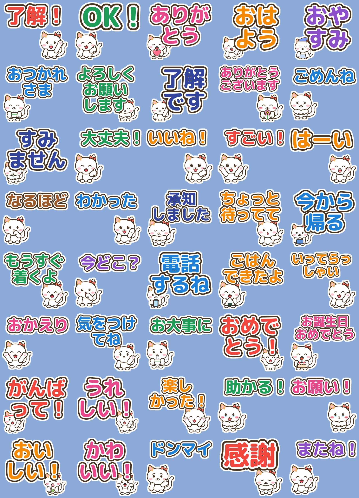
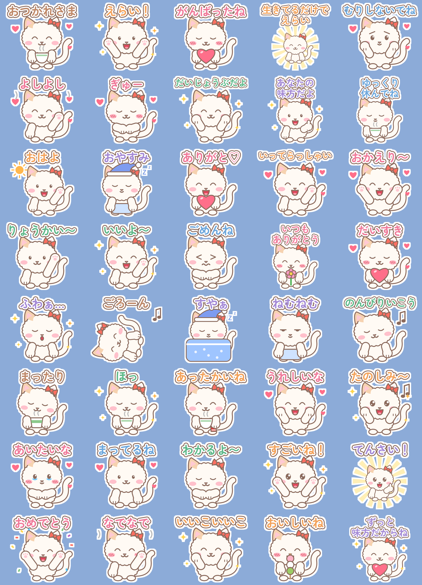
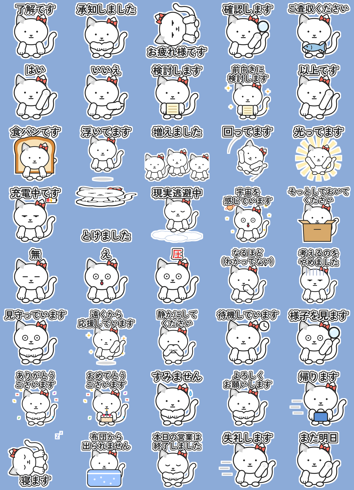
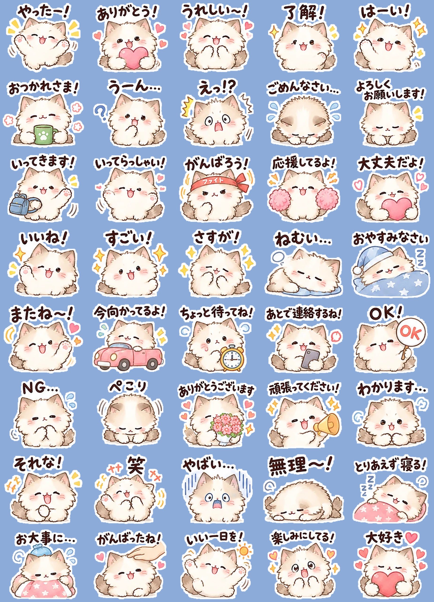
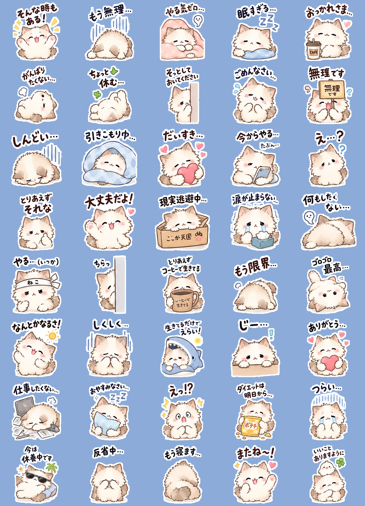
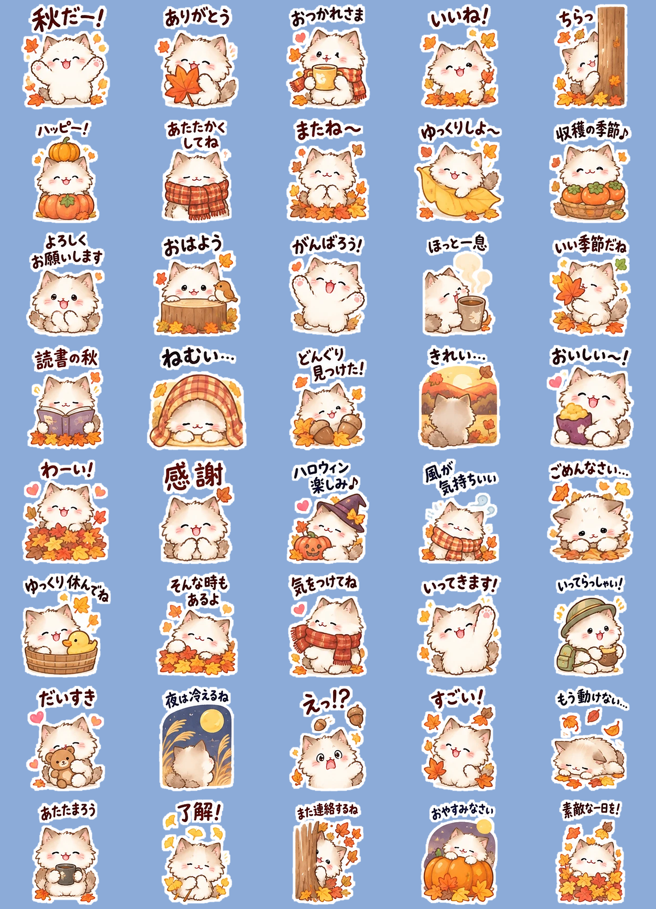
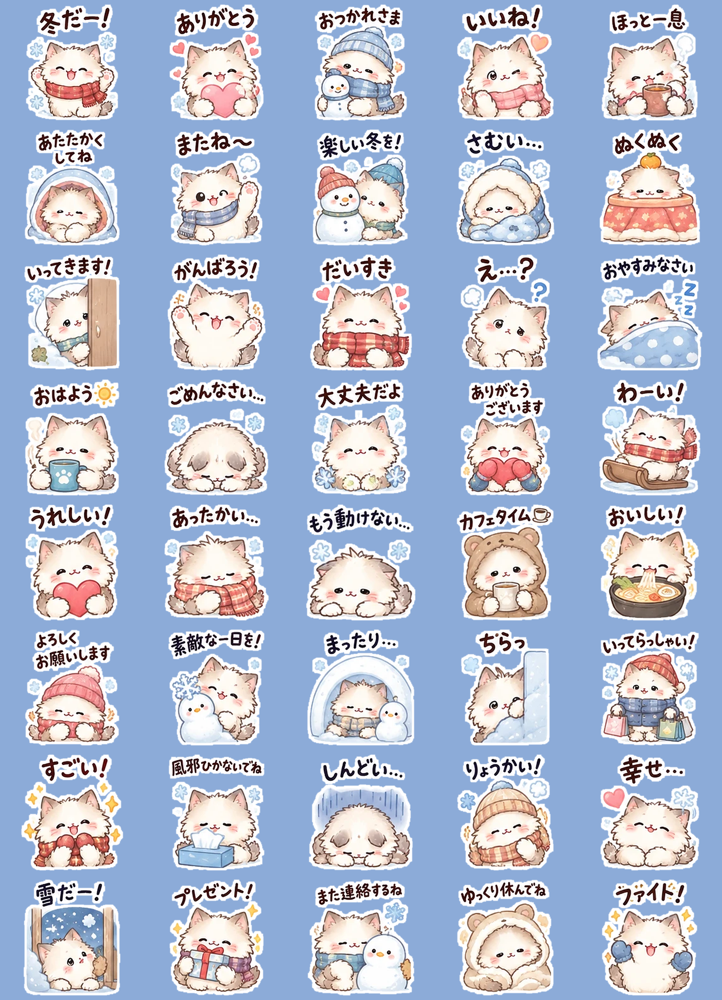

# しろねこ LINEスタンプ

| セット | 内容 | 状態 |
|---|---|---|
| 第1弾 `keigo` | 敬語しろねこ 40個 | 審査待ち（申請済み） |
| 第2弾 `kisetsu` | 敬語しろねこ 季節のごあいさつ 40個（手がぷっくり丸い新デザイン） | 申請準備中 |
| 第3弾 `deka` | しろねこのデカ文字 40個（40〜60代向け・普段使い） | 申請準備中 |
| 第4弾 `fuwafuwa` | ふわふわしろねこ 全肯定 40個（癒し系） | 申請準備中 |
| 第5弾 `shuru` | 真顔しろねこ シュール敬語 40個 | 申請準備中 |
| 別シリーズ `mofuneko` | もふもふねこ 毎日のきもち 40個（持ち込みの一覧画像から作成） | 申請準備中 |
| 別シリーズ `mofuneko_nega` | もふもふねこ そんな時もある 40個（ネガティブ表現・持ち込み画像から作成） | 申請準備中 |
| 別シリーズ `mofuneko_aki` | もふもふねこ 秋だー！ 40個（秋・持ち込み画像から作成） | 申請準備中 |
| 別シリーズ `shiba_moeru` | 燃えるシバイヌ 40個（持ち込み画像48コマから40個を選んで作成） | 申請準備中 |
| 別シリーズ `shiba_moetsuki` | 燃え尽きたシバイヌ 40個（持ち込み画像49コマから40個を選んで作成） | 申請準備中 |
| 別シリーズ `mofuneko_fuyu` | もふもふねこ 冬だー！ 40個（冬・持ち込み画像48コマから40個を選んで作成） | 申請準備中 |











> `output/keigo/` は申請した時点の画像をそのまま残している。今の generate.py で作り直すと、腕が第2弾と同じ丸い手になる。

## キャラクター
- **白くてぽっちゃりしたねこ**に、**赤いリボン**と**片耳のトラ模様**の2つの目印を付けた
- 一覧の小さなサムネイルでも「あのねこ」と分かるようにしている

## 売れるための設計
| ポイント | 内容 |
|---|---|
| ターゲット | 30〜50代。職場・目上の人・ママ友など、敬語を使う相手とのやりとり |
| セリフ | 使う頻度が高い順に並べた（01〜10が毎日使うあいさつ）。LINEでは先頭のスタンプが目立つ |
| 文字 | 太い丸ゴシック＋2重フチで、スマホの小さい画面やダークモードでも読める |
| 枚数 | 40個。「これ1つで足りる」と思ってもらえる |
| 絵柄 | 全40個でキャラの形を統一。LINEの審査でも、キャラがブレていないことが求められる |

## 販売ページ用の文案
- **タイトル（候補）**
  1. ていねい敬語しろねこ【毎日使える】
  2. 敬語でやさしく♪しろねこスタンプ
  3. 大人のための丁寧しろねこ
- **説明文**：リボンがチャームポイントのしろねこが、ていねいな敬語であいさつ。職場でも目上の方にも使いやすい、毎日使える40種類です。
- **価格**：¥190（日本での最低価格）

## LINE Creators Market への申請手順
1. https://creator.line.me/ja/ に登録する（無料・個人でも可）
2. 「新規登録」→「スタンプ」を選び、タイトル・説明文・販売価格を入力する
3. `output/` 内の次のファイルをZIPにまとめてアップロードする
   - `01.png`〜`40.png`（370×320px、透過PNG）
   - `main.png`（240×240px）
   - `tab.png`（96×74px）
   - ※ `preview.png` は確認用なので含めない
4. 「リクエスト」を送信すると審査が始まる（数日〜）
5. 承認されたら「リリース」を押して販売開始

## 作り直し方
```bash
pip install cairosvg pillow
# fonts/ のフォント（M PLUS Rounded 1c / Zen Maru Gothic / Zen Kaku Gothic New, すべて SIL OFL）をOSにインストールしておく
python stickers/generate.py keigo     # 第1弾
python stickers/generate.py kisetsu   # 第2弾
python stickers/generate.py deka      # 第3弾（LAYOUT="deka" で文字を大きく配置）
python stickers/generate.py fuwafuwa  # 第4弾（STYLE で毛並み・やわらかい線に切り替え）
python stickers/generate.py shuru     # 第5弾（STYLE で白黒・真顔に切り替え）
```
- セリフ・表情・ポーズを変えたいときは `sets/<セット名>.py` を編集する。新しいセットも同じ形でファイルを足せば作れる
- 絵はすべてコード（SVG）で描いている。ただし描画プログラムとデザインはAI（Claude）が作ったので、LINEの申請では「AIを使用しています」を選ぶ
- フォントはすべてSIL Open Font Licenseのため、商用スタンプに利用できる

## 第2弾 販売ページ用の文案
- **タイトル（日本語）**：ていねい敬語しろねこ 季節のごあいさつ
- **タイトル（英語）**：Polite White Cat: Seasonal Greetings
- **説明文（日本語）**：リボンのしろねこが、季節のごあいさつを丁寧な敬語で。ハロウィン・クリスマス・お正月から春夏まで、一年中使える40種類です。
- **説明文（英語）**：A chubby white cat with a red ribbon sends polite seasonal greetings in Japanese, from Halloween and New Year to spring and summer. 40 stickers for all year.

## 第3弾 販売ページ用の文案
- **タイトル（日本語）**：しろねこのデカ文字【毎日使える】
- **タイトル（英語）**：Big Text White Cat: Everyday Words
- **説明文（日本語）**：大きな文字で読みやすい！リボンのしろねこが、家族や友だちとの毎日のやりとりにぴったりな40種類。了解・ありがとう・今から帰るなど。
- **説明文（英語）**：Big, easy-to-read words with a chubby white cat. 40 everyday stickers for family and friends: OK, thank you, on my way home and more.
- メイン画像は「了解！」のスタンプ（デカ文字だと一目で分かるように）

## 第4弾・第5弾のリサーチ結果（2026年10月）
- 「かわいい猫」「ゆるい犬」だけでは飽和していて埋もれる → 使う場面やテーマを絞って差別化する
- 癒し系は「ふわふわ・ぽてっと・パステル」が安定して人気（シマエナガ・うさぎ・こぐま など）
- シュール系は「白黒・無表情・脱力・シンプルな線」が人気。「シュールだけどおしゃれ」が求められている
- シンプルなデザインが男女とも選ばれやすく、毎日使える定番の言葉が結局いちばん使われる
- 人気キャラのシリーズ2弾・3弾は既存ファンが買ってくれる

## 第4弾 販売ページ用の文案
- **タイトル（日本語）**：ふわふわしろねこ 全肯定
- **タイトル（英語）**：Fluffy White Cat: You're Doing Great
- **説明文（日本語）**：もふもふのしろねこが、がんばるあなたをやさしく全肯定。おつかれさま・えらい・むりしないでね。毎日に癒しを届ける40種類です。
- **説明文（英語）**：A fluffy white cat gently cheers you on: good job, you're amazing, take it easy. 40 soothing stickers for every day.

## 第5弾 販売ページ用の文案
- **タイトル（日本語）**：真顔しろねこ シュール敬語
- **タイトル（英語）**：Deadpan White Cat: Polite and Surreal
- **説明文（日本語）**：真顔のしろねこが、丁寧な敬語のままとけたり浮いたり食パンになったり。職場でも使えるシュールな40種類です。
- **説明文（英語）**：A deadpan white cat speaks polite Japanese while melting, floating or turning into toast. 40 surreal stickers you can even use at work.

## もふもふねこ（一覧画像から作るセット）
1枚の一覧画像（白背景にスタンプが格子状に並んだもの）から、そのまま申請できる一式を作る。

```bash
pip install pillow numpy scipy
python stickers/fix_mofuneko_eye.py   # 「笑」の描き忘れた右目を補った版を作る
python stickers/from_sheet.py stickers/source/mofuneko_sheet_fixed.png mofuneko --drop 29,40 --main 2
```
- 元画像の33番「笑」は右目が描かれていなかったので、左目を反転して口をはさんだ対称の位置に描き足している（出力では32番）
- 白い余白から格子を自動で切り分け、外周の白い背景を透明にする。毛が真っ白でも欠けないよう、輪郭のすき間をふさいでから内側を残している
- `--drop 29,40`：元画像の29「お疲れさまです」（カップのロゴが実在チェーン店に似ていて商標リスク）と、40「また連絡するね！」（24「あとで連絡するね！」と重複）を外して40個にしている
- タブ画像は文字を除いて猫だけにしている
- 元画像は1枚1254px（1コマ約190px）なので約1.8倍に拡大している。より大きい元画像があれば、同じコマンドでくっきり作り直せる
- **販売ページ用の文案**
  - タイトル（日本語）：もふもふねこ 毎日のきもち ／（英語）：Fluffy Kitty: Everyday Feelings
  - 説明文（日本語）：もふもふのねこが毎日のきもちを届けます。ありがとう・了解・おつかれさま・大好きなど、家族や友だちと使いやすい40種類。
  - 説明文（英語）：A super fluffy kitty shares everyday feelings: thank you, OK, good job, love you and more. 40 stickers for family and friends.

## もふもふねこ そんな時もある（ネガティブ表現）
```bash
python stickers/from_sheet.py stickers/source/mofuneko_negative_sheet.webp mofuneko_nega --cols 8 --main 1
```
- この画像はコマの幅が行ごとにバラバラで、小物（壁・箱など）が隣のコマにはみ出しているため `--cols 8` を指定する。
  行ごとに縦の白い隙間で切り（足りなければいちばん広いコマを線の少ない所で切る）、境目をまたぐ絵や文字は多く入っている側のコマに入れる
- LINEの特集企画「そんな時もある！ネガティブ表現スタンプ」特集に合うので、申請画面の「特集企画」で参加するを選ぶ
- **販売ページ用の文案**
  - タイトル（日本語）：もふもふねこ そんな時もある ／（英語）：Fluffy Kitty: It's Okay to Feel Down
  - 説明文（日本語）：もう無理…やる気ゼロ…そんな時もある！もふもふのねこが、ゆるいネガティブな気持ちをやさしく代弁する40種類。
  - 説明文（英語）：A fluffy kitty speaks for your low days: so tired, zero motivation, I'm done... and that's okay. 40 gentle stickers for every mood.

## もふもふねこ 秋だー！
```bash
python stickers/from_sheet.py stickers/source/mofuneko_aki_sheet.webp mofuneko_aki --cols 8 --main 1
```
- コマの間に白い隙間がない所があるので `--cols 8`。セリフの行は近くの文字を1つにまとめてから振り分けるので、境目で切れたセリフ（「ゆっくり休んでね」など）も丸ごと1コマに入る
- 隣のコマの絵を消すときは、まわりの色のにじみも消し、コマの端に残った細い切れ端も取り除いている
- **販売ページ用の文案**
  - タイトル（日本語）：もふもふねこ 秋だー！ ／（英語）：Fluffy Kitty: Cozy Autumn Days
  - 説明文（日本語）：紅葉・どんぐり・お月見・ハロウィン。もふもふのねこが秋の気持ちを届けます。あいさつにも使える秋いっぱいの40種類。
  - 説明文（英語）：Autumn leaves, acorns, moon viewing and Halloween. A fluffy kitty shares cozy autumn feelings in 40 stickers you can use every day.

## もふもふねこ 冬だー！
```bash
python stickers/fix_fuyu_eye.py   # 7「またね〜」の白目に見える左目を黒目に描き直した版を作る
python stickers/from_sheet.py stickers/source/mofuneko_fuyu_sheet_fixed.png mofuneko_fuyu --cols 8 --drop 21,24,27,36,38,39,44,47 --main 1
```
- 元画像は48コマなので、似ている8個を外して40個にしている
  - 21「楽しいね！」/ 24「ゆっくりしてね」（46と重複）/ 27「さむすぎる…」（9と重複）/ 36「いつもありがとう」/
    38「一緒にがんばろう！」/ 39「…」（32「ちらっ」と同じ構図）/ 44「あたたかくして過ごしてね」（6と重複）/ 47「素敵な冬を…」
- **販売ページ用の文案**
  - タイトル（日本語）：もふもふねこ 冬だー！ ／（英語）：Fluffy Kitty: Warm Winter Days
  - 説明文（日本語）：雪・こたつ・マフラー・雪だるま。もふもふのねこが冬のあったかい気持ちを届けます。あいさつにも使える冬いっぱいの40種類。
  - 説明文（英語）：Snow, kotatsu, scarves and snowmen. A fluffy kitty shares warm winter feelings in 40 stickers you can use every day.

## 燃えるシバイヌ
```bash
python stickers/from_sheet.py stickers/source/shiba_moeru_sheet.webp shiba_moeru --cols 8 --drop 12,14,21,26,31,32,34,45 --main 1
```
- 48コマから8個を外して40個：12「よしっ！」/ 14「わーい！」（46と重複）/ 21「そんな時もある！」/ 26「もう無理…」（25・27と重複）/
  31「ねむい…」（29・48と重複）/ 32「寒い…」（季節限定）/ 34「お疲れさまです！」（33と重複、マグのロゴ）/ 45「怒ってないよ〜」
- 文案：燃えるシバイヌ ／ Fired-Up Shiba
  - やるぞー！燃えてきた！熱い柴犬が全力で応援。燃え尽きた…も言える、毎日使える40種類。
  - Let's go! A fired-up Shiba cheers you on with full power, and admits when it's burnt out too. 40 everyday stickers.

## 燃えるシバイヌ（動く版・24個）
```bash
python stickers/animate.py shiba_moeru 1:bounce 2:shake 3:nod 4:wiggle 5:bounce 6:nod 8:zoom 9:dash 11:wiggle 13:bounce 14:squash 17:shake 19:nod 20:nod 22:squash 25:squash 27:wiggle 28:dash 29:tremble 33:wiggle 34:zoom 36:tremble 38:bounce 39:beat
```
- 静止画40個から24個を選び、1枚の絵を動かす簡易アニメ（APNG）にしている
  - 動き：bounce=はねる / shake=ぶるぶる / wiggle=ゆらゆら / squash=ぽよん / zoom=どーん / nod=ぺこり / dash=走る / tremble=ぷるぷる / beat=どきどき
- LINE規格：320x270（メインは240x240のAPNG、タブは96x74のPNG）、5〜20コマ、ループ1〜4回、再生4秒以内、1ファイル300KB以下、1セット8・16・24個
- **再生時間はちょうど1・2・3・4秒のどれかでないとアップロードでエラーになる**（6コマ×166ms×3回=2.988秒でエラーが出た）。今は全部ちょうど3秒：8コマ×125ms×3回、6コマ×250ms×2回、5コマ×200ms×3回
- 300KBに収まるまで「8コマ256色 → 8コマ128色 → 6コマ256色 …」の順に試し、全コマ共通の色で減色している
- 文案：燃えるシバイヌ【動く】 ／ Fired-Up Shiba: Animated
  - 動いて燃える！やるぞー・了解・ありがとう・燃え尽きた…熱い柴犬が全力で動く24種類。
  - A fired-up Shiba that moves! Let's go, OK, thank you, burnt out... 24 animated stickers full of energy.

## 燃え尽きたシバイヌ
```bash
python stickers/from_sheet.py stickers/source/shiba_moetsuki_sheet.webp shiba_moetsuki --cols 7 --drop 2,4,13,17,22,23,31,37,38 --main 1
```
- 7列×7行=49コマから9個を外して40個：2「もう無理…」/ 4「やる気0…」/ 13「燃えカス…」（43と重複）/ 17「今はムリです」/
  22「さむい…」・23「あたたまりたい…」（季節限定）/ 31「今はひとりにして…」（犬がほぼ見えない）/ 37「行きたくない…」（16と同じ構図）/ 38「布団が天国…」（8・9と重複）
- 「そんな時もある！ネガティブ表現スタンプ」特集に合う
- 文案：燃え尽きたシバイヌ ／ Burnt-Out Shiba
  - 燃え尽きた…動けない…休ませて…。がんばりすぎた柴犬が、ゆるっとダラダラ気持ちを代弁。でもまたがんばる40種類。
  - Burnt out... can't move... let me rest. A tired Shiba speaks for your lazy days, then tries again. 40 stickers.

## 次の展開案（シリーズ化すると売上が伸びる）
- 動くスタンプ版（単価が上がる）
- ナース・医療職版（職場ネタ、競合が少ない）
